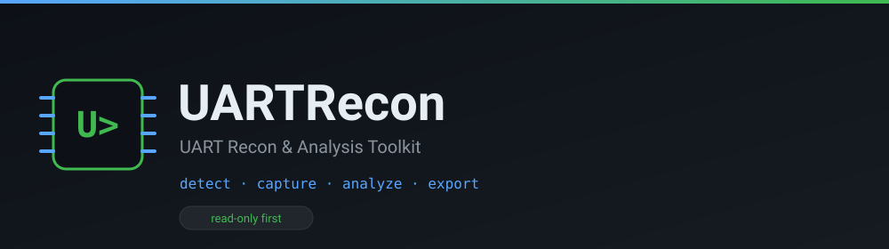
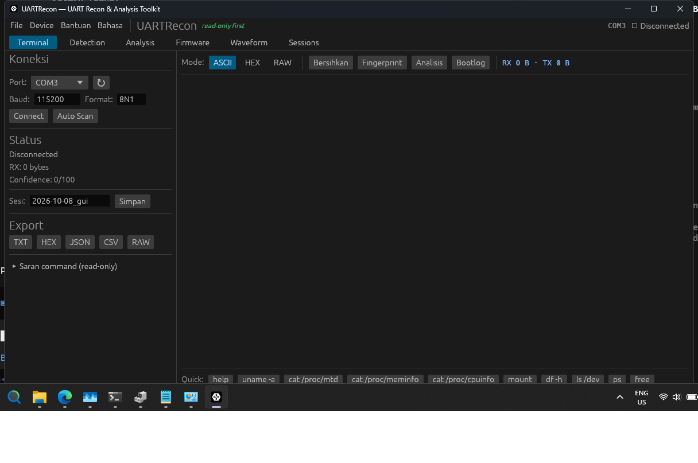
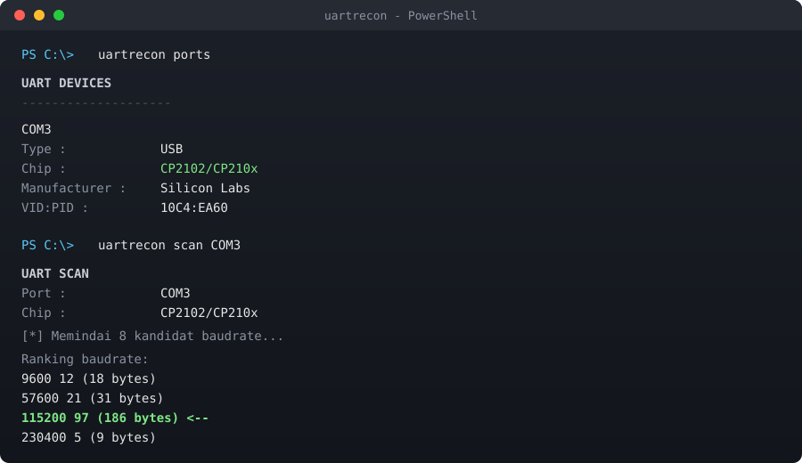

<div align="center">



**Toolkit buat ngulik perangkat embedded lewat UART.**

Deteksi baudrate otomatis, capture, analisis firmware, sampai recovery — semua read-only.

Dibuat dengan **Rust** 🦀 — cross-platform, cepat, tanpa runtime.

[](https://github.com/JonJavaDev/uartrecon/actions/workflows/ci.yml)
[](https://github.com/JonJavaDev/uartrecon/actions/workflows/release.yml)
[](LICENSE)
[](https://www.rust-lang.org)
[](#install)

[Install](#install) · [Pakai](#pakai) · [Screenshot](#screenshot) · [Fitur](#fitur) · [Docs](docs/)

</div>

---

## Kenapa

Kalau nemu STB/router/modem bekas, biasanya baudrate-nya nggak diketahui. Cara manual:
coba 115200 → garbage → coba 57600 → garbage → coba 9600 → baru ketemu.

UARTRecon otomatis nyari baudrate + format yang bener, terus nyimpen hasilnya.
Semua **read-only** — nggak ada operasi tulis/erase flash.

## Screenshot



<sub>GUI desktop: terminal live, deteksi, analisis firmware, dan logic analyzer.</sub>

**CLI:**



## Fitur

<table>
<tr>
<td width="50%" valign="top">

**Detect & Capture**
- Daftar serial port + deteksi chip USB-UART (CP2102, CH340, FT232, PL2303)
- Scan baudrate otomatis + scoring (confidence 0–100)
- Deteksi format UART: 8N1, 8E1, 8O1, 8N2, 7E1, 7O1
- Capture RX/TX terpisah + hash SHA-256
- Fingerprint: U-Boot, Linux, BusyBox, vendor/SoC

</td>
<td width="50%" valign="top">

**Analisis**
- Logic analyzer: decode UART dari waveform
- Signature scanner (mirip binwalk): SquashFS, JFFS2, UBIFS, gzip, xz, uImage, …
- Entropy: deteksi bagian compressed/encrypted
- Strings: ekstraksi teks + pola menarik
- Stats, diff, search (literal/regex/hex)

</td>
</tr>
<tr>
<td valign="top">

**Operasi Device**
- Terminal interaktif real-time (Ctrl+] keluar)
- Safety: blokir command ke partisi kritis
- Backup & restore partisi via SD card
- Flash LEDE/OpenWrt ke STB (workflow otomatis)

</td>
<td valign="top">

**Interfaces**
- CLI + menu interaktif
- TUI (ratatui) dengan panel waveform
- GUI desktop (egui/eframe)
- Bahasa: Indonesia & English

</td>
</tr>
</table>

## Install

### Windows — installer

Unduh dari [Releases](https://github.com/JonJavaDev/uartrecon/releases):

| Installer | Isi |
|-----------|-----|
| `uartrecon-full-*-setup.exe` | CLI + TUI + GUI |
| `uartrecon-gui-*-setup.exe` | GUI saja |
| `uartrecon-cli-*-setup.exe` | CLI + TUI |
| `uartrecon-*.msi` | MSI package |

### Dari source (semua platform)

```bash
git clone https://github.com/JonJavaDev/uartrecon
cd uartrecon
cargo build --release
```

**Dependensi:**
- **Linux**: `libudev-dev pkg-config` (dan `libgtk-3-dev libxkbcommon-dev libwayland-dev` untuk GUI)
- **macOS**: Xcode Command Line Tools
- **Windows**: Visual Studio Build Tools (C++)

## Pakai

Paling gampang — langsung buka menu:

```bash
cargo run
```

Atau langsung ke subcommand:

```bash
# Daftar port
uartrecon ports

# Terminal interaktif (seperti PuTTY, Ctrl+] keluar)
uartrecon terminal COM3 --baud 115200

# Scan baudrate otomatis
uartrecon scan COM3

# Analisis file capture / firmware
uartrecon analyze capture.raw
uartrecon signatures --file firmware.bin
uartrecon strings --file firmware.bin --interesting
uartrecon entropy --file firmware.bin

# Safety & recovery
uartrecon safety
uartrecon safety --check "flash_erase /dev/mtd1 0 1"
uartrecon recover plan --device STB

# Ganti bahasa
uartrecon lang en
```

Lihat semua: `uartrecon --help`

## Terminal & U-Boot

### Terminal interaktif (seperti PuTTY)

```bash
uartrecon terminal COM3
uartrecon terminal COM3 --baud 115200 --auto      # deteksi baudrate otomatis
uartrecon terminal COM3 --spam 20                 # spam Enter 20s (tangkan autoboot)
uartrecon terminal COM3 --log session.log         # simpan sesi
```

**Hotkey**: `Ctrl+]` keluar · `Ctrl+T` timestamp · `Ctrl+H` bantuan.

Opsi: `--enter cr|lf|crlf` · `--backspace bs|del` · `--spam-delay <ms>` ·
`--spam-key enter|space|ctrl-c` · `--timestamp`.

### U-Boot (auto-spam, anti-ribet)

Masuk U-Boot otomatis walau autoboot cepat (`bootdelay=0`):

```bash
# Masuk U-Boot lalu interaktif (ketik 'norm', 'safe', 'printenv', ...)
uartrecon uboot COM3

# Reboot + auto-kirim command (non-interaktif, cocok skrip)
uartrecon uboot COM3 --reboot --send "setenv system norm; saveenv; printenv"

# Kalau bootloader butuh tombol lain
uartrecon uboot COM3 --spam-key space
```

Opsi: `--reboot` · `--send <cmd;cmd>` (multi-command) · `--seconds <N>` ·
`--spam-delay <ms>` · `--spam-key enter|space|ctrl-c` · `--send-delay <ms>` · `--log`.


## Catatan teknis

USB-to-UART biasa nggak kasih timing sinyal mentah ke aplikasi, jadi deteksi baud
pakai **scanning + scoring**, bukan pengukuran fisik. Untuk baud fisik sebenarnya
perlu logic analyzer (fitur `logic`).

Kalau nggak ada traffic yang bisa diandalkan, tool bilang terus terang
`No reliable traffic detected` — nggak maksa nebak.

Selengkapnya: [`docs/limitations.md`](docs/limitations.md)

## Struktur

```
crates/
├── uartrecon-core/   # engine (tanpa clap/ratatui/egui)
├── uartrecon-cli/    # binary `uartrecon`
├── uartrecon-tui/    # binary `uartrecon-tui`
└── uartrecon-gui/    # binary `uartrecon-gui`
```

`uartrecon-core` nggak bergantung ke CLI/TUI/GUI — semua pakai engine yang sama.

## Dibuat dengan Rust

Seluruh proyek ini 100% Rust (edition 2024). Nggak ada runtime tambahan —
hasilnya binary native tunggal yang cepat dan kecil.

| Komponen | Crate |
|----------|-------|
| Serial I/O | [`serialport`](https://crates.io/crates/serialport) |
| CLI | [`clap`](https://crates.io/crates/clap) |
| TUI | [`ratatui`](https://crates.io/crates/ratatui) + [`crossterm`](https://crates.io/crates/crossterm) |
| GUI | [`egui`](https://crates.io/crates/egui) + [`eframe`](https://crates.io/crates/eframe) |
| Serialisasi | [`serde`](https://crates.io/crates/serde) + [`toml`](https://crates.io/crates/toml) |
| Hashing | [`sha2`](https://crates.io/crates/sha2) |
| Error handling | [`thiserror`](https://crates.io/crates/thiserror) + [`anyhow`](https://crates.io/crates/anyhow) |
| Regex | [`regex`](https://crates.io/crates/regex) |

**Build:** `cargo build --release` · **Test:** `cargo test --workspace`

## Kontribusi

```bash
cargo fmt --all
cargo clippy --workspace --all-targets -- -D warnings
cargo test --workspace
```

Lihat [CONTRIBUTING.md](CONTRIBUTING.md).

## Lisensi

[MIT](LICENSE)
